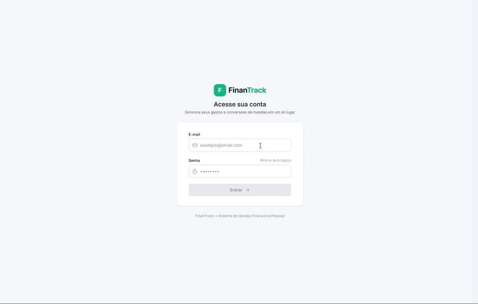
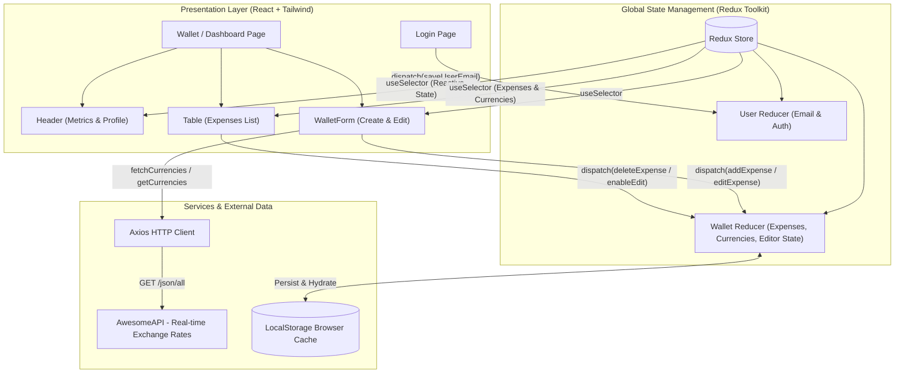

# 💳 FinanTrack | Multi-Currency Wallet & Expense Manager

[](https://react.dev/)
[](https://www.typescriptlang.org/)
[](https://redux-toolkit.js.org/)
[](https://tailwindcss.com/)
[](https://vitejs.dev/)
[](https://vitest.dev/)
[](https://opensource.org/licenses/MIT)

> 🇺🇸 **English** | 🇧🇷 [**Versão em Português**](README.md)

**FinanTrack** is a modern web application for international and domestic personal expense management. It allows users to log expenses in multiple foreign currencies, automatically converting amounts to Brazilian Real (BRL) based on real-time exchange rates retrieved from a live public API, while locking historical rates at the time of entry.

## 📌 Quick Navigation

- [📝 About The Project](#-about-the-project)
- [🖼️ Preview](#️-preview)
- [🌐 Application Deployment](#-application-deployment)
- [⚡ API Endpoints](#-api-endpoints)
- [✨ Features](#-features)
- [🛠️ Technologies & Tools](#️-technologies--tools)
- [🏛️ Solution Architecture](#️-solution-architecture)
- [📁 Repository Structure](#-repository-structure)
- [💡 Technical Decisions](#-technical-decisions)
- [🚀 How to Run the Project](#-how-to-run-the-project)
- [📄 License](#-license)

## 📝 About The Project

Designed to deliver clarity and precision for international trips, remote workers, or global currency transactions, **FinanTrack** combines a sleek, responsive dark glassmorphic user interface with predictable, robust state management powered by **Redux**.

Every expense entry captures live currency exchange rates at the exact submission time, ensuring financial accuracy in accumulated total calculations and offering a full interactive table with inline editing and deletion capabilities.

## 🖼️ Preview

<div align="center">
  
</div>

## 🌐 Application Deployment

Access the live production application:
👉 **[FinanTrack](https://finantrack-gamma.vercel.app/)**

## ⚡ API Endpoints

The application consumes the public **AwesomeAPI** foreign exchange endpoint to fetch live currencies and rates:

| Method | Endpoint | Description |
| :--- | :--- | :--- |
| `GET` | `https://economia.awesomeapi.com.br/json/all` | Returns real-time quotations for all supported currencies against the Brazilian Real (BRL), filtering out USDT based on business rules. |

Sample API response payload:
```json
{
  "USD": {
    "code": "USD",
    "codein": "BRL",
    "name": "Dólar Americano/Real Brasileiro",
    "high": "5.7512",
    "low": "5.6830",
    "ask": "5.7245",
    "timestamp": "1738000000"
  }
}
```

## ✨ Features

- **🔐 Real-Time Authentication Validation**: Login form with real-time email syntax check and password length validation (6+ chars) with clear visual cues.
- **📊 Metric Dashboard Cards**:
  - Total converted balance in BRL reactively computed.
  - Total count of recorded transactions.
  - Highest single recorded expense.
  - Distinct foreign currencies utilized count and badges.
- **💱 Real-Time Currency Conversion**: Dynamic rate fetching during expense creation, preserving historical quotation stamps per entry.
- **📝 Complete Expense CRUD**:
  - Add expenses with description, amount, currency, payment method, and category (Food, Transport, Leisure, Work, Health).
  - Inline table editing without losing initial exchange rate snapshots.
  - Instant expense deletion with automated total balance recalculation.
- **💾 LocalStorage State Persistence**: Automatically syncs expenses and user session to the browser's storage across page reloads.
- **🎨 Modern & Responsive UI**: Refined dark theme with emerald/slate accents, responsive tables, and interactive micro-animations.

## 🛠️ Technologies & Tools

| Layer / Purpose | Technology | Description |
| :--- | :--- | :--- |
| **Core Language** | **TypeScript 5.7** | End-to-end strict typing for code safety and maintainability |
| **UI Library** | **React 18.3** | Modular UI built with Functional Components and Custom Hooks |
| **State Management** | **Redux Toolkit 2.5 & React-Redux** | Predictable unidirectional state flow for expenses and user data |
| **Styling** | **Tailwind CSS 3.4** | Utility-first styling with dark mode and glassmorphism styling |
| **HTTP Client** | **Axios 1.7** | Typed asynchronous HTTP client for currency rate API consumption |
| **Routing** | **React Router DOM 6.28** | Structured SPA routing between Login and Dashboard views |
| **Iconography** | **Lucide React 0.475** | Modern, lightweight, and customizable SVG icons |
| **Build Tool & Bundler** | **Vite 6.1** | Blazing-fast development environment and optimized production bundling |
| **Automated Testing** | **Vitest 3.0 & React Testing Library** | Unit and integration test suite covering reducers and UI components |
| **Code Quality & Linting** | **ESLint 9 & TypeScript-ESLint** | Code standards, static analysis, and best practice enforcement |

## 🏛️ Solution Architecture



## 📁 Repository Structure

```text
project-trybe-wallet/
├── docs/
│   └── images/
│       └── projeto.gif             # Animated project demonstration GIF
├── public/                         # Static assets (favicon, manifest)
├── src/
│   ├── components/
│   │   ├── Header.tsx              # Header with metrics summary and active user
│   │   ├── Table.tsx               # Interactive expenses table with currency conversions
│   │   └── WalletForm.tsx          # Expense creation and inline edit form
│   ├── pages/
│   │   ├── Login.tsx               # Authentication and validation page
│   │   ├── Wallet.tsx              # Main dashboard wallet view
│   │   └── NotFound.tsx            # 404 Route fallback
│   ├── redux/
│   │   ├── actions/
│   │   │   └── index.ts            # Action creators and async thunks
│   │   ├── reducers/
│   │   │   ├── index.ts            # Combined root reducer
│   │   │   ├── user.ts             # User authentication reducer
│   │   │   └── wallet.ts           # Expenses and exchange rates reducer
│   │   └── store.ts                # Redux store configuration and typing
│   ├── services/
│   │   └── api.ts                  # Axios configuration for AwesomeAPI
│   ├── tests/                      # Automated test suite with Vitest
│   │   ├── Login.test.tsx
│   │   ├── Wallet.test.tsx
│   │   └── WalletReducer.test.ts
│   ├── types/
│   │   └── wallet.ts               # TypeScript interfaces (Expense, Currency, etc.)
│   ├── App.tsx                     # Route configuration and navigation tree
│   ├── index.css                   # Global styles and Tailwind directives
│   ├── main.tsx                    # Application entry point with Providers
│   └── setupTests.ts               # Vitest environment setup with Jest-DOM
├── eslint.config.js                # ESLint configuration
├── index.html                      # HTML template with custom Google fonts
├── package.json                    # Project dependencies and script runner
├── tailwind.config.js              # Custom Tailwind CSS configuration
├── tsconfig.json                   # TypeScript compiler configuration
└── vite.config.ts                  # Vite and Vitest configuration
```

## 💡 Technical Decisions

- **Immutability & Historical Exchange Snapshot**: When adding an expense, the full currency exchange rates snapshot is immutably stored in the expense record (`exchangeRates`). This ensures subsequent exchange rate fluctuations never alter past transaction history.
- **Unidirectional Global Redux Flow**: Redux guarantees that distinct components (`Header`, `WalletForm`, `Table`) stay in sync reactively during CRUD operations without prop drilling.
- **Hybrid Local Storage Persistence**: State is automatically persisted to `localStorage`, preserving all user transactions across browser refreshes and sessions.
- **Modern Fintech Design Tokens**: Deep slate and emerald color tokens with glassmorphism create high-contrast, accessible, and engaging micro-interactions.
- **Comprehensive Vitest Coverage**: Includes mocked API unit and integration testing across reducers, forms, and calculation integrity.

## 🚀 How to Run the Project

### Prerequisites
- [Node.js](https://nodejs.org/) (version 18.x or higher recommended)
- [npm](https://www.npmjs.com/) or [yarn](https://yarnpkg.com/)

### Step by step

1. **Clone the repository:**
   ```bash
   git clone https://github.com/ludson96/project-trybe-wallet.git
   cd project-trybe-wallet
   ```

2. **Install dependencies:**
   ```bash
   npm install
   ```

3. **Start the local development server:**
   ```bash
   npm run dev
   ```
   Open your browser and navigate to: `http://localhost:5173`

4. **Run automated test suite:**
   ```bash
   # Single run
   npm test

   # Interactive watch mode
   npm run test:watch
   ```

5. **Generate production build:**
   ```bash
   npm run build
   ```

## 📄 License

This project is licensed under the [MIT](LICENSE) License. See the `LICENSE` file for details.

<div align="center">
  Developed by <strong>Ludson Pereira dos Santos</strong> 🚀<br />
  <a href="https://www.linkedin.com/in/ludson96/">LinkedIn</a> • <a href="https://github.com/ludson96">GitHub</a> • <a href="mailto:ludson_ps27@hotmail.com">Email</a>
</div>
