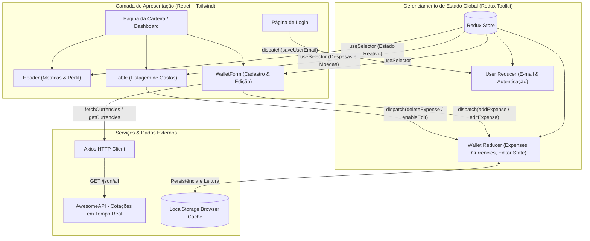

# 💳 FinanTrack | Carteira de Câmbio & Gestão Financeira

[](https://react.dev/)
[](https://www.typescriptlang.org/)
[](https://redux-toolkit.js.org/)
[](https://tailwindcss.com/)
[](https://vitejs.dev/)
[](https://vitest.dev/)
[](https://opensource.org/licenses/MIT)

> 🇧🇷 **Português** | 🇺🇸 [**English Version**](README.en.md)

O **FinanTrack** é uma aplicação web moderna para controle e gestão de despesas internacionais e nacionais. Ela permite registrar gastos em diversas moedas estrangeiras, convertendo automaticamente os valores para Real brasileiro (BRL) com base em cotações cambiais obtidas em tempo real via API pública, mantendo o histórico de cotação fixado no momento do registro.

## 📌 Navegação Rápida

- [📝 Sobre o Projeto](#-sobre-o-projeto)
- [🖼️ Preview](#️-preview)
- [🌐 Deploy da Aplicação](#-deploy-da-aplicação)
- [⚡ API Endpoints](#-api-endpoints)
- [✨ Funcionalidades](#-funcionalidades)
- [🛠️ Tecnologias e Ferramentas Utilizadas](#️-tecnologias-e-ferramentas-utilizadas)
- [🏛️ Arquitetura da Solução](#️-arquitetura-da-solução)
- [📁 Estrutura do Repositório](#-estrutura-do-repositório)
- [💡 Decisões Técnicas](#-decisões-técnicas)
- [🚀 Como Executar o Projeto](#-como-executar-o-projeto)
- [📄 Licença](#-licença)

## 📝 Sobre o Projeto

Desenvolvido para proporcionar clareza e controle sobre gastos realizados em viagens ou transações em moeda estrangeira, o **FinanTrack** une uma interface rica, responsiva e com efeitos de glassmorphism a um gerenciamento de estado previsível e robusto com **Redux**. 

Cada despesa adicionada captura a taxa de câmbio atual da moeda escolhida no momento exato do lançamento, assegurando fidelidade financeira no cálculo do total acumulado e permitindo visualização detalhada em tabela com edição e remoção inline.

## 🖼️ Preview

<div align="center">
  
</div>

## 🌐 Deploy da Aplicação

Acesse a aplicação em produção:
👉 **[FinanTrack](https://finantrack-gamma.vercel.app/)**

## ⚡ API Endpoints

A aplicação consome a API de cotações pública **AwesomeAPI** para busca de moedas e taxas de câmbio atualizadas:

| Método | Endpoint | Descrição |
| :--- | :--- | :--- |
| `GET` | `https://economia.awesomeapi.com.br/json/all` | Retorna as cotações em tempo real de todas as moedas disponíveis em relação ao Real (BRL), excluindo USDT conforme regra de negócio. |

Exemplo de estrutura da resposta consumida:
```json
{
  "USD": {
    "code": "USD",
    "codein": "BRL",
    "name": "Dólar Americano/Real Brasileiro",
    "high": "5.7512",
    "low": "5.6830",
    "ask": "5.7245",
    "timestamp": "1738000000"
  }
}
```

## ✨ Funcionalidades

- **🔐 Autenticação com Validação em Tempo Real**: Formulário de login com validação de formato de e-mail e comprimento mínimo de senha (6+ caracteres) com feedback visual.
- **📊 Dashboard com Cards de Métricas**:
  - Total geral convertido em BRL atualizado reativamente.
  - Quantidade total de transações registradas.
  - Maior despesa individual lançada.
  - Quantidade e lista de moedas estrangeiras utilizadas.
- **💱 Câmbio em Tempo Real**: Busca automática de taxas cambiais no momento exato em que a despesa é cadastrada, preservando a taxa histórica de cada item.
- **📝 Gestão Completa de Despesas (CRUD)**:
  - Adição de novos gastos com descrição, valor, moeda, método de pagamento e categoria (Alimentação, Transporte, Lazer, etc.).
  - Edição inline diretamente na tabela sem perder a cotação original.
  - Exclusão imediata de lançamentos com recálculo automático do saldo.
- **💾 Persistência em LocalStorage**: Salva e sincroniza automaticamente o estado das despesas e usuário ativo no navegador.
- **🎨 Interface Moderna e Responsiva**: Dark mode com gradientes refinados, componentes de tabela responsivos e ícones visuais interativos.

## 🛠️ Tecnologias e Ferramentas Utilizadas

| Camada / Finalidade | Tecnologia | Descrição |
| :--- | :--- | :--- |
| **Linguagem Principal** | **TypeScript 5.7** | Tipagem estrita ponta a ponta para maior manutenibilidade e segurança |
| **Biblioteca UI** | **React 18.3** | Componentização modular com Functional Components e Hooks |
| **Gerenciamento de Estado** | **Redux Toolkit 2.5 & React-Redux** | Fluxo unidirecional de dados previsível para despesas e usuário |
| **Estilização** | **Tailwind CSS 3.4** | Design system utilitário com suporte a Dark Mode e efeitos Glassmorphism |
| **Cliente HTTP** | **Axios 1.7** | Requisições assíncronas tipadas para consumo da API de câmbio |
| **Roteamento** | **React Router DOM 6.28** | Navegação SPA estruturada entre Login e Dashboard |
| **Ícones** | **Lucide React 0.475** | Conjunto moderno e leve de ícones vetoriais |
| **Build Tool & Bundler** | **Vite 6.1** | Ambiente de desenvolvimento ultra-rápido e bundling otimizado |
| **Testes Automatizados** | **Vitest 3.0 & React Testing Library** | Suíte de testes unitários e de integração para reducers e componentes |
| **Padronização de Código** | **ESLint 9 & TypeScript-ESLint** | Validação de boas práticas, linting e qualidade de código |

## 🏛️ Arquitetura da Solução



## 📁 Estrutura do Repositório

```text
project-trybe-wallet/
├── docs/
│   └── images/
│       └── projeto.gif             # Demonstração visual animada do sistema
├── public/                         # Arquivos estáticos (favicon, manifest)
├── src/
│   ├── components/
│   │   ├── Header.tsx              # Cabeçalho com métricas, saldo e usuário ativo
│   │   ├── Table.tsx               # Tabela de transações com conversão de moedas
│   │   └── WalletForm.tsx          # Formulário reativo de inclusão e edição de gastos
│   ├── pages/
│   │   ├── Login.tsx               # Tela de autenticação e validação
│   │   ├── Wallet.tsx              # Visão principal do dashboard financeiro
│   │   └── NotFound.tsx            # Tratamento de rotas inexistentes (404)
│   ├── redux/
│   │   ├── actions/
│   │   │   └── index.ts            # Action creators e thunks assíncronos
│   │   ├── reducers/
│   │   │   ├── index.ts            # Root Reducer
│   │   │   ├── user.ts             # Reducer de autenticação do usuário
│   │   │   └── wallet.ts           # Reducer de despesas e cotações
│   │   └── store.ts                # Configuração e tipagem da Redux Store
│   ├── services/
│   │   └── api.ts                  # Configuração de chamadas HTTP à AwesomeAPI
│   ├── tests/                      # Suíte de testes automatizados com Vitest
│   │   ├── Login.test.tsx
│   │   ├── Wallet.test.tsx
│   │   └── WalletReducer.test.ts
│   ├── types/
│   │   └── wallet.ts               # Interfaces TypeScript (Expense, Currency, etc.)
│   ├── App.tsx                     # Definição e mapeamento de rotas da aplicação
│   ├── index.css                   # Configurações globais de estilos e Tailwind
│   ├── main.tsx                    # Ponto de entrada com Providers (Redux & Router)
│   └── setupTests.ts               # Configuração do ambiente Jest DOM no Vitest
├── eslint.config.js                # Configuração do linter ESLint
├── index.html                      # Template HTML base com fontes customizadas
├── package.json                    # Dependências e scripts de execução
├── tailwind.config.js              # Configurações de tema e cores Tailwind CSS
├── tsconfig.json                   # Configurações do compilador TypeScript
└── vite.config.ts                  # Configuração do bundler Vite e Vitest
```

## 💡 Decisões Técnicas

- **Imutabilidade e Precisão Cambial**: Ao registrar uma despesa, a taxa de câmbio de todas as moedas naquele instante é anexada permanentemente ao objeto da despesa (`exchangeRates`). Isso garante que variações cambiais futuras não alterem o histórico financeiro do lançamento.
- **Redux Global Unidirecional**: O uso do Redux garante que múltiplos componentes descentralizados (`Header`, `WalletForm` e `Table`) reajam instantaneamente a inserções, edições ou exclusões de despesas sem prop drilling.
- **Persistência Híbrida**: O estado é sincronizado com o `localStorage`, proporcionando uma experiência de usuário contínua mesmo ao recarregar a aba ou reiniciar o navegador.
- **Design Tokens com Tailwind**: Utilização de paleta Slate/Emerald escura focada em fintechs, garantindo contraste acessível, microinterações em botões e inputs responsivos.
- **Qualidade Assegurada com Vitest**: Suíte de testes com mocks de API cobrindo comportamentos críticos, validação de formulários e integridade dos cálculos matemáticos de conversão.

## 🚀 Como Executar o Projeto

### Pré-requisitos
- [Node.js](https://nodejs.org/) (versão 18.x ou superior recomendada)
- [npm](https://www.npmjs.com/) ou [yarn](https://yarnpkg.com/)

### Passo a passo

1. **Clone o repositório:**
   ```bash
   git clone https://github.com/ludson96/project-trybe-wallet.git
   cd project-trybe-wallet
   ```

2. **Instale as dependências:**
   ```bash
   npm install
   ```

3. **Inicie o servidor de desenvolvimento:**
   ```bash
   npm run dev
   ```
   Acesse a aplicação no navegador em: `http://localhost:5173`

4. **Executar os testes automatizados:**
   ```bash
   # Execução única
   npm test

   # Modo watch interativo
   npm run test:watch
   ```

5. **Gerar a build de produção:**
   ```bash
   npm run build
   ```

## 📄 Licença

Este projeto está sob a licença [MIT](LICENSE). Consulte o arquivo `LICENSE` para mais detalhes.

<div align="center">
  Desenvolvido por <strong>Ludson Pereira dos Santos</strong> 🚀<br />
  <a href="https://www.linkedin.com/in/ludson96/">LinkedIn</a> • <a href="https://github.com/ludson96">GitHub</a> • <a href="mailto:ludson_ps27@hotmail.com">E-mail</a>
</div>
